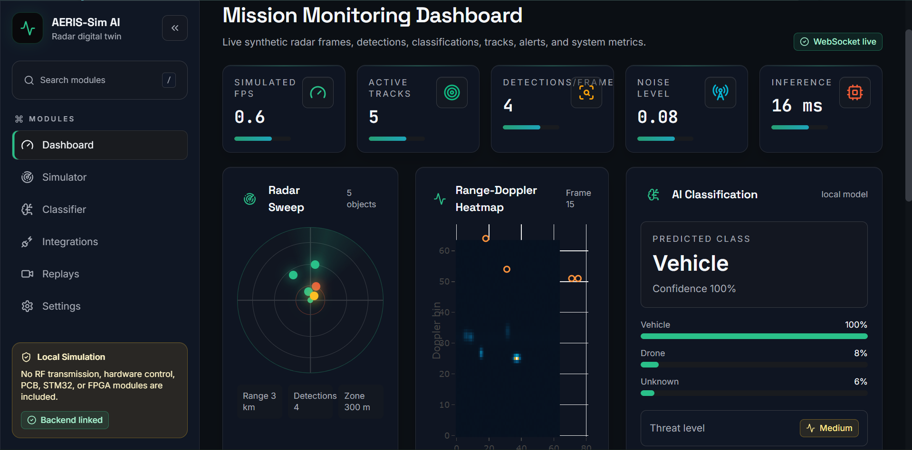
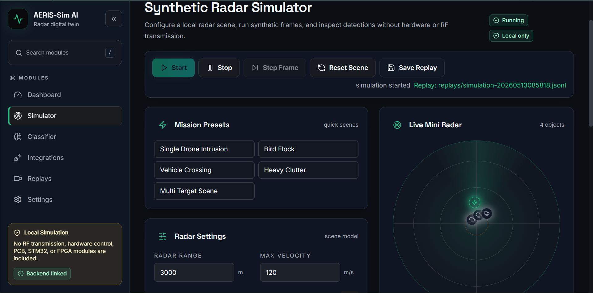
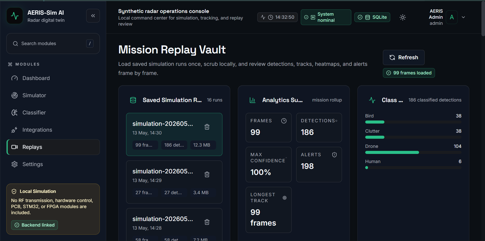
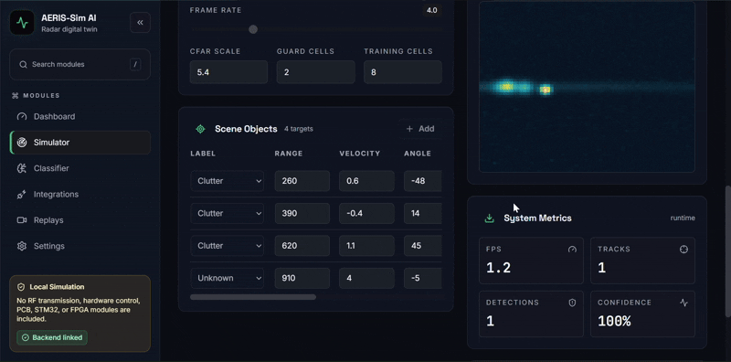
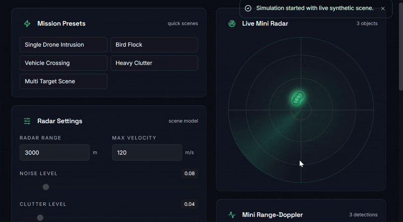
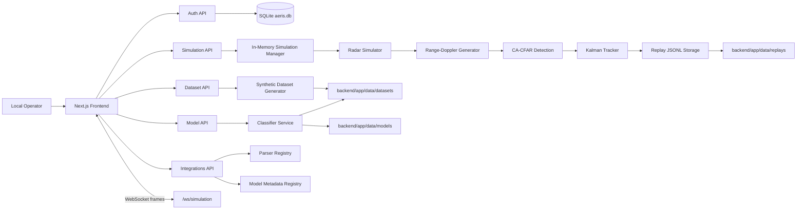

# AERIS-Sim AI

**Software Digital Twin for Radar Detection, Drone Tracking, and AI Classification**


AERIS-Sim AI is a local-only radar digital twin for experimenting with synthetic target scenes, range-Doppler heatmaps, CFAR-style detection, Kalman tracking, replay analytics, and AI object classification. It is designed as a polished software lab and command-center dashboard for radar-inspired simulation workflows.

This project does **not** control hardware, transmit RF, implement firmware, generate PCB files, or operate a real radar system.

## Screenshots

> Replace these placeholders with real screenshots when publishing the repository.











## What It Does

AERIS-Sim AI simulates radar-like scenes containing moving objects such as drones, birds, vehicles, humans, clutter, and unknown targets. The backend generates synthetic range-Doppler frames, detects peaks, tracks targets over time, stores replay frames, and trains local classifiers on generated datasets. The frontend turns those signals into a futuristic but practical monitoring experience with live radar sweep panels, heatmaps, target tables, alerts, settings, integrations, and replay review.

## Features

- Software-only radar digital twin with configurable synthetic scenes
- Moving object simulation with range, velocity, angle, RCS, altitude, and heading
- Synthetic 2D range-Doppler heatmap generation
- Gaussian noise, clutter, and object-specific signature variation
- Educational 2D CA-CFAR detection
- Constant-velocity Kalman tracking
- Local object classification for `drone`, `bird`, `vehicle`, `human`, `clutter`, and `unknown`
- Synthetic dataset generation with `.npy` samples and JSON metadata
- Optional small PyTorch CNN mode when PyTorch is installed
- scikit-learn fallback classifier for lightweight local training
- Real-time simulation stream over WebSocket
- Replay storage and frame-by-frame mission review
- CSV radar-like data upload and column mapping
- Custom model metadata registry with arbitrary Python execution disabled by default
- Local JWT authentication with role support
- Dark/light command-center UI with responsive dashboard layouts

## Tech Stack

### Frontend

- Next.js 14 App Router
- TypeScript
- Tailwind CSS
- shadcn/ui-style local components
- next-themes
- Framer Motion
- lucide-react
- Plotly / react-plotly.js
- Recharts

### Backend

- FastAPI
- Python 3.11+
- SQLite
- Pydantic
- NumPy
- SciPy
- scikit-learn
- passlib bcrypt
- python-jose JWT
- Uvicorn
- Optional PyTorch support

## Architecture



## Local Setup

Run the backend and frontend in separate terminals.

### Backend: Windows PowerShell

```powershell
cd backend
python -m venv .venv
.\.venv\Scripts\Activate.ps1
python -m pip install --upgrade pip
pip install -r requirements.txt
uvicorn app.main:app --reload
```

If you use Windows Command Prompt instead of PowerShell:

```bat
cd backend
python -m venv .venv
.\.venv\Scripts\activate.bat
python -m pip install --upgrade pip
pip install -r requirements.txt
uvicorn app.main:app --reload
```

### Backend: macOS/Linux

```bash
cd backend
python3.11 -m venv .venv
source .venv/bin/activate
python -m pip install --upgrade pip
pip install -r requirements.txt
uvicorn app.main:app --reload
```

Backend URL:

- API: `http://localhost:8000`
- Health check: `http://localhost:8000/health`
- OpenAPI docs: `http://localhost:8000/docs`

You can also run `python run_backend.py`, but `uvicorn app.main:app --reload` is the recommended development command.

### Frontend

```bash
cd frontend
npm install
npm run dev
```

Frontend URL:

- App: `http://localhost:3000`

## Default Login Credentials

The backend auto-creates a default admin user when the users table is empty.

```text
Email:    admin@aeris.local
Password: admin123
Role:     admin
```

This is local development authentication only. Do not reuse the default admin password or local JWT secret in a production system.

## API Overview

### Health

- `GET /health`

### Auth

- `POST /api/auth/register`
- `POST /api/auth/login`
- `GET /api/auth/me`

### Simulation

- `POST /api/simulation/start`
- `POST /api/simulation/stop`
- `POST /api/simulation/step`
- `GET /api/simulation/status`
- `POST /api/simulation/scene`
- `GET /api/simulation/current-frame`
- `GET /api/simulation/replays`
- `GET /api/simulation/replays/{replay_id}`
- `DELETE /api/simulation/replays/{replay_id}`
- `WebSocket /ws/simulation`

### Dataset

- `POST /api/dataset/generate`
- `GET /api/dataset/list`
- `GET /api/dataset/{dataset_id}`
- `GET /api/dataset/{dataset_id}/sample/{sample_id}`

### Model

- `POST /api/model/train`
- `POST /api/model/predict`
- `GET /api/model/status`
- `GET /api/model/list`
- `POST /api/model/load-custom`

### Integrations

- `POST /api/integrations/upload-data`
- `POST /api/integrations/parse`
- `GET /api/integrations/parsers`
- `POST /api/integrations/upload-model-metadata`
- `GET /api/integrations/model-adapters`

## Folder Structure

```text
aeris-sim-ai/
  README.md
  .gitignore
  backend/
    app/
      main.py
      config.py
      database.py
      auth.py
      models.py
      schemas.py
      api/
        auth_routes.py
        simulation_routes.py
        dataset_routes.py
        model_routes.py
        integration_routes.py
      services/
        radar_simulator.py
        range_doppler.py
        cfar.py
        kalman_tracker.py
        classifier.py
        dataset_generator.py
        replay_service.py
        simulation_manager.py
        websocket_manager.py
      custom_integrations/
        parser_registry.py
        model_registry.py
        sample_csv_parser.py
      data/
        aeris.db
        datasets/
        models/
        replays/
    requirements.txt
    run_backend.py
  frontend/
    app/
      page.tsx
      login/page.tsx
      register/page.tsx
      dashboard/page.tsx
      simulator/page.tsx
      classifier/page.tsx
      integrations/page.tsx
      replays/page.tsx
      settings/page.tsx
    components/
      auth/
      dashboard/
      integrations/
      landing/
      replays/
      settings/
      simulator/
      theme/
      ui/
    lib/
      api.ts
      auth.ts
      websocket.ts
      types.ts
      utils.ts
    styles/
      globals.css
    package.json
```

## Custom Data Integration Guide

AERIS-Sim AI includes a local integration workspace for importing radar-like CSV data.

1. Open `http://localhost:3000/integrations`.
2. Upload a CSV file.
3. Map source columns to AERIS fields:
   - `range_m`
   - `velocity_mps`
   - `angle_deg`
   - `amplitude`
   - `timestamp`
   - `class_label`
4. Run the parser.
5. Review the preview table, warnings, and parsed metadata.

The default parser lives at:

```text
backend/app/custom_integrations/sample_csv_parser.py
```

Parser discovery is handled through:

```text
backend/app/custom_integrations/parser_registry.py
```

Custom parsers should validate input, normalize units, return warnings for uncertain mappings, and avoid side effects outside the local data workspace.

## Custom Model Integration Guide

AERIS-Sim AI supports two local model paths:

- Train a built-in classifier from generated synthetic datasets.
- Register metadata for an external/custom model adapter.

Built-in model workflow:

1. Open `http://localhost:3000/classifier`.
2. Generate a synthetic dataset.
3. Train a `sklearn` model, or choose CNN mode if PyTorch is installed.
4. Run predictions against generated samples.
5. Review model status, classes, confidence, and inference timing.

Custom metadata workflow:

1. Open `http://localhost:3000/integrations`.
2. Fill in model name, type, expected input shape, classes, and notes.
3. Register the adapter metadata.
4. Review registered adapters from the integrations page.

Important safety default: arbitrary Python execution for uploaded models is disabled. The custom model registry is currently metadata-oriented unless you explicitly extend the backend with a trusted adapter.

## Safety and Scope

AERIS-Sim AI is an educational and experimental software simulation project.

It does not include:

- RF transmission logic
- Radar hardware control
- Real radar device integration
- PCB or KiCad design
- STM32 firmware
- FPGA implementation
- Classified or sensitive radar algorithms

All simulation, detection, tracking, replay, dataset, and classification workflows are synthetic and local-only.

## Credits

Inspired by open-source PLFM radar concepts from `NawfalMotii79/PLFM_RADAR`, especially ideas around radar simulation, range-Doppler heatmaps, CFAR detection, tracking, and dashboard workflows.

This project is built from scratch as a software-only digital twin and does not include hardware control or RF transmission.

## Future Roadmap

- richer scenario preset library
- replay comparison mode
- model evaluation reports and confusion matrices
- better synthetic signature controls per object class
- import/export bundles for datasets and trained models
- authenticated workspace profiles
- parser SDK examples
- ONNX metadata support
- live chart performance tuning for larger heatmaps
- downloadable replay summaries
- screenshot gallery for GitHub

## License

License: TBD

Add the final license file before publishing or distributing this project.
